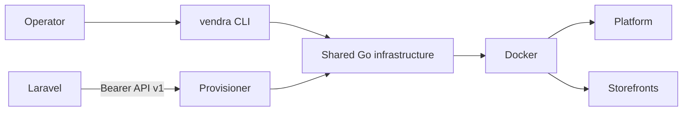

# Architecture

The host CLI and provisioner share the packages under `internal/`. Docker and
Compose execution is centralized in `internal/docker` and `internal/compose`;
renderers and HTTP handlers never invoke shell commands directly.

Laravel owns tenant, storefront, billing, retry, and audit state. Runtime files
under `/var/lib/vendra` are reconstructable controller state.

