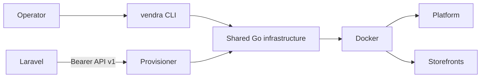

# Architecture

The host CLI and provisioner share the packages under `internal/`. Docker and
Compose execution is centralized in `internal/docker` and `internal/compose`;
renderers and HTTP handlers never invoke shell commands directly.

> **System architecture lives in the ecosystem docs.**
> How this controller relates to the Laravel platform and the storefront, where
> state ownership sits, and the full request path:
> <https://misaf.github.io/vendra-ecosystem-docs/overview/architecture>
>
> This file covers only the internal Go package layout of *this* repository.
