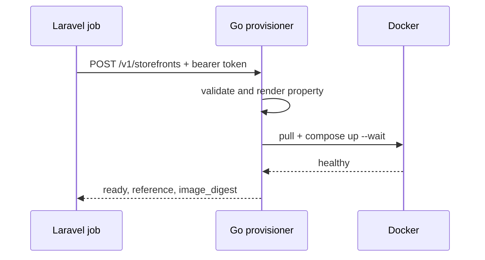

# Provisioning

The machine-readable contract is `api/openapi.yaml` in this repository, and it
remains authoritative for request and response shapes.

**Prose documentation lives in the ecosystem documentation:**

- Provisioner API — <https://misaf.github.io/vendra-ecosystem-docs/controller/provisioning>
- Contract rules and limits — <https://misaf.github.io/vendra-ecosystem-docs/api/provisioner>
