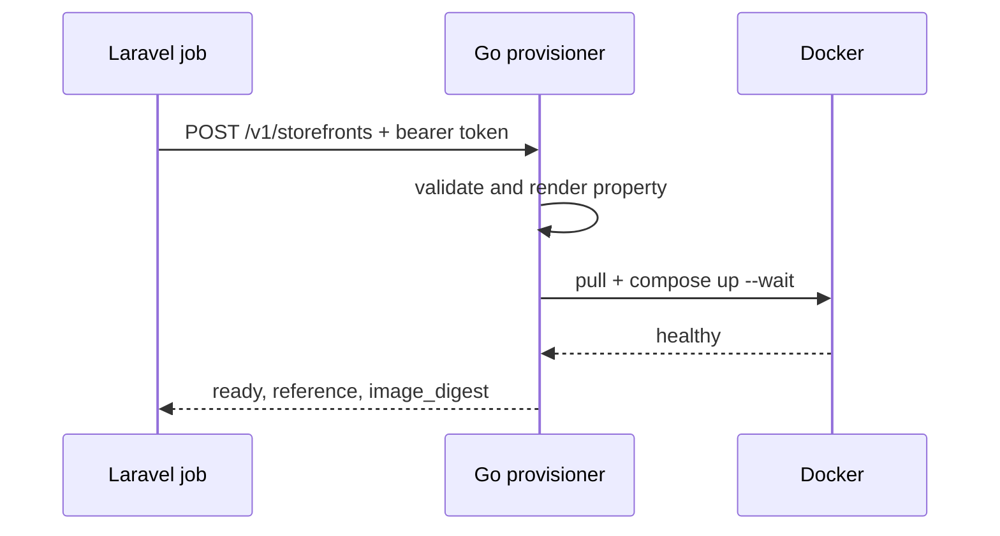

# Provisioning

```mermaid
sequenceDiagram
    participant L as Laravel job
    participant P as Go provisioner
    participant D as Docker
    L->>P: POST /v1/storefronts + bearer token
    P->>P: validate and render property
    P->>D: pull + compose up --wait
    D-->>P: healthy
    P-->>L: ready, reference, image_digest
```

The API contract is published in `api/openapi.yaml`. Requests are limited to
1 MiB and the provisioner serializes property/certificate mutations.

